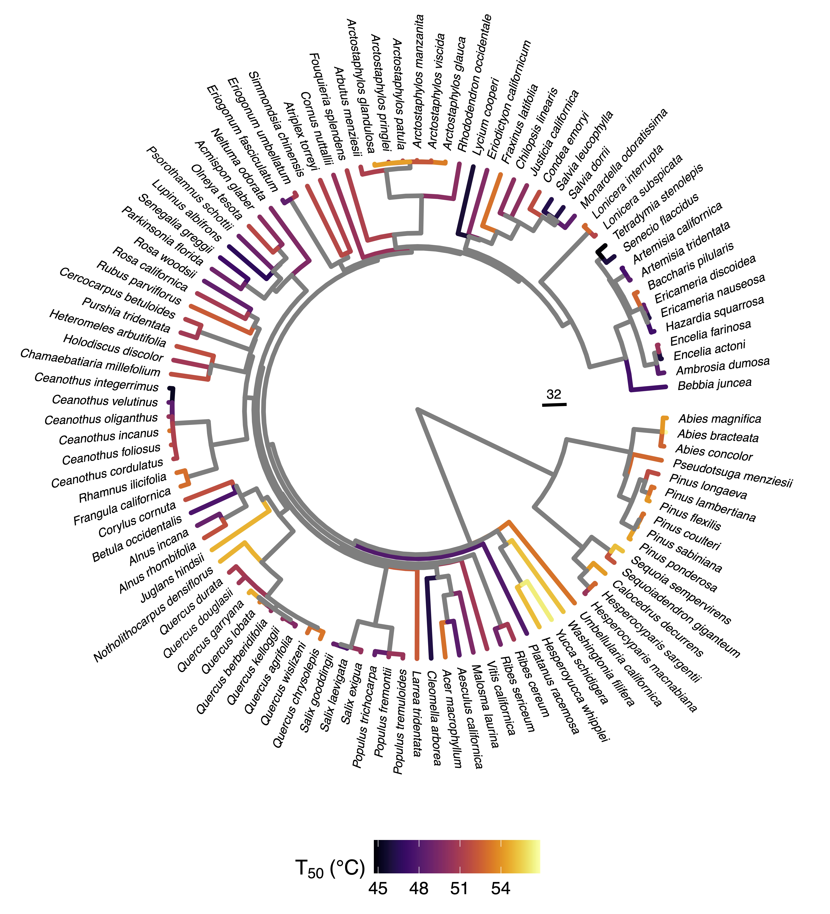
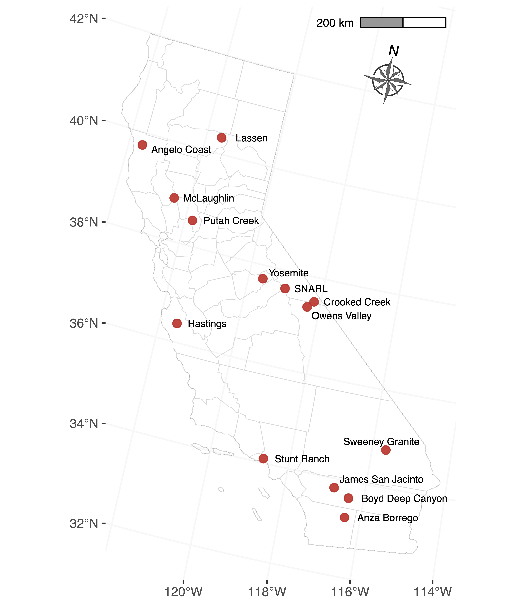
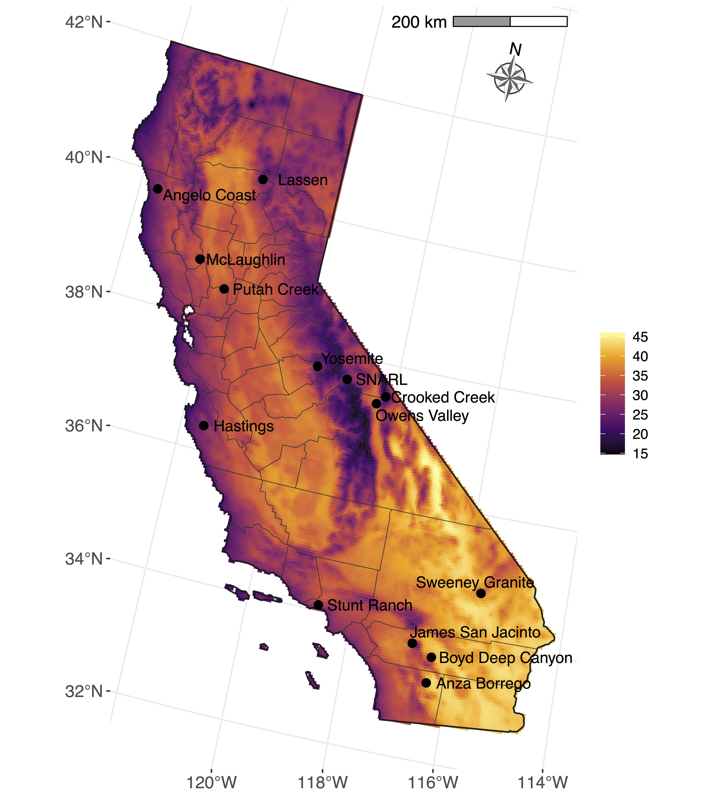

I am passionate about creating beautiful data visualizations. Clear and appealing graphics are essential for communicating scientific findings effectively, and are paramount to tell a complete story of your data.

Here, I am sharing my favorite graphs and R code in the hopes that this might help any researcher looking for inspiration. 

Here, I am using examples of my own data of plant heat tolerances (T50 and TCrit) and other leaf traits, but these examples will work with any kind of data you have. 

## Phylogenies

Packages used:
```{r}
#| eval: false
#| warning: false

# Install packages not available in this current R version
library("devtools")
devtools::install_github("jinyizju/V.PhyloMaker2")

if (!requireNamespace("BiocManager", quietly = TRUE))
  install.packages("BiocManager")
BiocManager::install("ggtree")

# Load packages 
library(tidyverse)
library(readxl)
#library(V.PhyloMaker) # I will use the updated version
library(V.PhyloMaker2)
library(phytools)
library(ape)
library(ggtree)
library(geiger)
library(viridis)
library(ggtreeExtra)
```

I constructed the phylogenies using a 2 mega-trees as a back bone with the "V.PhyloMaker2" package. Here an example of how it is done:

```{r}
#| eval: false
#| warning: false

spp <- spp |> 
  dplyr::select(c(species, genus, family))

# Generating phylogeny based on my species list
tree_pc <- V.PhyloMaker2::phylo.maker(sp.list = spp, 
                                     tree = GBOTB.extended.WP, 
                                     # With WP, I am using the species based on The World of Plants
                                     nodes = nodes.info.1.WP, 
                                     scenarios = "S3")
# WFO website: https://www.worldfloraonline.org

# Save tree
# write.tree(tree_pc$scenario.3, "../data/figure_1a.tre")
```

Find original paper [here](https://doi.org/10.1016/j.pld.2022.05.005) (Jin & Qian, 2022)

### 1. Phylogeny color coded by trait (V1)

The next two examples are great ways to show the phylogeny and traits data associated when you have too many species. 

```{r}
#| eval: false
#| warning: false

# Here I start with a tree called "tree" and traits data called "t50"
# For the traits data, I only have one column called "T50" with the heat 
# tolerance data, and another column called "species"

# Map the base tree
p <- ggtree(tree, layout = "circular", # To make a circular phylogeny
            ladderize = FALSE) # change internal structure of the tree

# Summarise T50 data to have a single mean value per species
traits_t50_b <- t50 |> 
  group_by(species) |> 
  summarise(t50 = mean(T50)) |> 
  ungroup()

# Map the trait data to the tree
tree_t50 <- p %<+% traits_t50_b 

# Prepare data for custom tip labels
tip_t50<- tree_t50$data |> 
  filter(isTip == TRUE) |> 
  select(label, x, y, node, angle, isTip) 

tiplab_t50 <- tip_t50 |> 
  left_join(name_map_df, 
            by = c("label" = "original_label")) |>
  mutate(display_label_final = ifelse(is.na(display_label), 
                                      label, display_label))
# Plot phylogeny
tree_t50 <- tree_t50 +
  geom_tree(aes(color = t50),
            size = 1.5) +
  scale_color_viridis(option = "B", # Color selection
                      name =  expression("T"[50]~"(°C)")) +
  geom_tiplab(size = 2.8, # Size of the species names
              fontface = "italic",
              offset = 15, # Space in between of species names and tree 
              data = tiplab_t50, 
              mapping = aes(label = display_label_final),
              align = TRUE,
              linesize = 0.00, # Lines connecting tips to names are invisible
              linetype = "blank", # Delete line that connects tree tips with spp. names
              inherit.aes = FALSE) +  
  xlim(0, 420) +
  theme(legend.position = "bottom", 
        legend.key.size = unit(0.8, "cm"), # Sets overall area/size of the legend
        legend.text = element_text(size = 12), # Font size of legend's numbers
        title = element_text(size = 14)) + # Font size of legend's title
  geom_treescale(fontsize = 3, # Customized treescale
                 linesize = 1, 
                 offset = 0.8)
```

{fig-align="center" width=80%}

### 2. Phylogeny color coded by trait (V2)

```{r}
#| eval: false
#| warning: false

# Summarise T50 data to have a single mean value per species
t50_df_raw <- t50 |> 
  group_by(species) |> 
  summarise(t50 = mean(T50)) |> 
  ungroup()

# Prepare trait data for gheatmap
# The data for gheatmap needs row names that match the tree's tip labels
# And the values to be plotted should be in a column
# IMPORTANT: Standardize species names to match tree tip labels

t50_df_prepared <- t50_df_raw |> 
  mutate(species_tree_format = gsub(" ", "_", species)) |> 
  # Ensure all species in the tree have data, or handle missing ones
  filter(species_tree_format %in% tree$tip.label)

if (nrow(t50_df_prepared) == 0 && length(tree$tip.label) > 0) {
  stop("No matching species names between T50 data and tree tip labels after formatting. \nTree labels: ", 
       paste(head(tree$tip.label), collapse=", "), "\nFormatted T50 species: ", 
       paste(head(t50_df_prepared$species_tree_format), collapse=", "))}

# Create bins for the legend, include as many as needed
breaks <- c(42.1, 44.1, 46.1, 48.1, 50.1, 52.1, 54.1, 56.1, Inf) 
# Added Inf for values above 56.1 like in your example data

bin_labels <- c("(42.1, 44.1]", 
                "(44.1, 46.1]",
                "(46.1, 48.1]", 
                "(48.1, 50.1]", 
                "(50.1, 52.1]", 
                "(52.1, 54.1]",
                "(54.1, 56.1]",
                ">56.1")

t50_df_prepared <- t50_df_prepared |> 
  mutate(T50_bin = cut(t50,
                       breaks = breaks,
                       labels = bin_labels,
                       right = TRUE,
                       include.lowest = TRUE))

# Select the T50_bin column and set row names for gheatmap
heatmap_data <- data.frame(
  T50_Category = t50_df_prepared$T50_bin,
  row.names = t50_df_prepared$species_tree_format)

# Filter heatmap_data to include only tips present in the tree
heatmap_data <- heatmap_data[rownames(heatmap_data) %in% tree$tip.label,
                             drop = FALSE]
if (nrow(heatmap_data) == 0 && length(tree$tip.label) > 0) {
  stop("Heatmap data is empty after filtering for tree tip labels. Check species name matching.")
}

# Define the color palette (adjust if you added more bins)
palette_phylo <- c("#f77f00", "#eae2b7","#f3d180", "#fcbf49", "#e75414",
                   "#d62828", "#6b2c39", "#003049")

names(palette_phylo) <- bin_labels # Assign names to match factor levels for consistent coloring

# Create a name mapping for display labels
# Data frame with original labels and new display labels
name_map_df <- data.frame(
  stringsAsFactors = FALSE,
  original_label = c("Bebbia_juncea", "Ambrosia_dumosa", "Encelia_actoni", 
                     "Encelia_farinosa", "Hazardia_squarrosa", "Ericameria_nauseosa",
                     "Ericameria_discoidea", "Baccharis_pilularis", "Artemisia_tridentata", 
                     "Artemisia_californica", "Senecio_flaccidus", "Tetradymia_stenolepis",
                     "Lonicera_subspicata", "Lonicera_interrupta", "Monardella_odoratissima", 
                     "Salvia_dorrii", "Salvia_leucophylla", "Condea_emoryi", "Justicia_californica", 
                     "Chilopsis_linearis", "Fraxinus_latifolia", "Eriodictyon_californicum",
                     "Lycium_cooperi", "Rhododendron_occidentale", "Arctostaphylos_patula", 
                     "Arctostaphylos_pringlei", "Arctostaphylos_glandulosa", "Arctostaphylos_glauca",
                     "Arctostaphylos_viscida", "Arctostaphylos_manzanita", "Arbutus_menziesii", 
                     "Fouquieria_splendens", "Cornus_nuttallii", "Atriplex_torreyi",
                     "Simmondsia_chinensis", "Eriogonum_umbellatum", "Eriogonum_fasciculatum", 
                     "Neltuma_odorata", "Acmispon_glaber", "Olneya_tesota", "Psorothamnus_schottii", 
                     "Lupinus_albifrons", "Senegalia_greggii", "Parkinsonia_florida", "Rosa_woodsii",
                     "Rosa_californica",
                     "Rubus_parviflorus", "Cercocarpus_betuloides","Purshia_tridentata", 
                     "Heteromeles_arbutifolia", "Holodiscus_discolor", "Chamaebatiaria_millefolium",
                     "Ceanothus_velutinus", "Ceanothus_foliosus", "Ceanothus_cordulatus", 
                     "Ceanothus_oliganthus", "Ceanothus_incanus", "Ceanothus_integerrimus", 
                     "Rhamnus_ilicifolia", "Frangula_californica", "Corylus_cornuta", 
                     "Betula_occidentalis", "Alnus_incana", "Alnus_rhombifolia", 
                     "Juglans_hindsii", "Notholithocarpus_densiflorus", "Quercus_douglasii", 
                     "Quercus_durata", "Quercus_garryana", "Quercus_lobata",
                     "Quercus_berberidifolia", "Quercus_kelloggii", "Quercus_agrifolia", 
                     "Quercus_wislizeni", "Quercus_chrysolepis", "Salix_laevigata",
                     "Salix_gooddingii", "Salix_exigua", "Populus_trichocarpa", "Populus_fremontii", 
                     "Populus_tremuloides", "Larrea_tridentata", "Cleomella_arborea", 
                     "Acer_macrophyllum", "Aesculus_californica", "Malosma_laurina", 
                     "Vitis_californica", "Ribes_sericeum",
                     "Ribes_cereum", "Platanus_racemosa", "Hesperoyucca_whipplei", "Yucca_schidigera",
                     "Washingtonia_filifera", "Umbellularia_californica", "Hesperocyparis_macnabiana", 
                     "Hesperocyparis_sargentii", "Calocedrus_decurrens", "Sequoiadendron_giganteum",
                     "Sequoia_sempervirens", "Pinus_ponderosa", "Pinus_sabiniana", "Pinus_coulteri", 
                     "Pinus_flexilis", "Pinus_lambertiana",
                     "Pinus_longaeva", "Pseudotsuga_menziesii", "Abies_concolor", "Abies_bracteata",
                     "Abies_magnifica"),
  display_label  = c("B. juncea", "A. dumosa", "E. actoni", "E. farinosa", 
                     "H. squarrosa", "E. nauseosa", "E. discoidea", 
                     "B. pilularis", "A. tridentata", "A. californica", 
                     "S. flaccidus", "T. stenolepis", "L. subspicata", 
                     "L. interrupta", "M. odoratissima", "S. dorrii",
                     "S. leucophylla", "C. emoryi", "J. californica", 
                     "C. linearis", "F. latifolia", "E. californicum", 
                     "L. cooperi", "R. occidentale", "A. patula", 
                     "A. pringlei", "A. glandulosa", "A. glauca",
                     "A. viscida", "A. manzanita", "A. menziesii", 
                     "F. splendens", "C. nuttallii", "A. torreyi",
                     "S. chinensis", "E. umbellatum", "E. fasciculatum", 
                     "N. odorata", "A. glaber", "O. tesota",
                     "P. schottii", "L. albifrons", "S. greggii", 
                     "P. florida", "R. woodsii", "R. californica",
                     "R. parviflorus", "C. betuloides","P. tridentata", 
                     "H. arbutifolia", "H. discolor", "C. millefolium",
                     "C. velutinus", "C. foliosus", "C. cordulatus", 
                     "C. oliganthus", "C. incanus", "C. integerrimus", 
                     "R. ilicifolia", "F. californica", "C. cornuta", 
                     "B. occidentalis", "A. incana", "A. rhombifolia", 
                     "J. hindsii", "N. densiflorus", "Q. douglasii", 
                     "Q. durata", "Q. garryana", "Q. lobata", 
                     "Q. berberidifolia", "Q. kelloggii", "Q. agrifolia", 
                     "Q. wislizeni", "Q. chrysolepis", "S. laevigata",
                     "S. gooddingii", "S. exigua", "P. trichocarpa", 
                     "P. fremontii", "P. tremuloides", "L. tridentata",
                     "C. arborea", "A. macrophyllum", "A. californica", 
                     "M. laurina", "V. californica", "R. sericeum",
                     "R. cereum", "P. racemosa", "H. whipplei", 
                     "Y. schidigera", "W. filifera", "U. californica", 
                     "H. macnabiana", "H. sargentii", "C. decurrens", 
                     "S. giganteum", "S. sempervirens", "P. ponderosa", 
                     "P. sabiniana", "P. coulteri", "P. flexilis", 
                     "P. lambertiana", "P. longaeva", "P. menziesii", 
                     "A. concolor", "A. bracteata", "A. magnifica"))


# Create a base plot
t <- ggtree(tree, layout = "circular", 
            branch.length = 'none')

heatmap_offset_from_tips <- 0.01 # Space between colors and phylogeny
heatmap_width <- 0.15            # Size of color bands

t_heatmap <- gheatmap(
  t,
  heatmap_data,
  offset = heatmap_offset_from_tips, 
  width = heatmap_width,             
  colnames = FALSE)

# Prepare data for custom tip labels
tip_plot_data <- t_heatmap$data |> 
  filter(isTip == TRUE) |> 
  select(label, x, y, node, angle, isTip) 

tiplab_data <- tip_plot_data |>
  left_join(name_map_df, by = c("label" = "original_label")) |>
  mutate(display_label_final = ifelse(is.na(display_label), 
                                      label, display_label))

# Define tiplab_offset
tiplab_offset_user <- 4.5

t_with_labels <- t_heatmap +
  geom_tiplab(data = tiplab_data,
              mapping = aes(label = display_label_final),
              offset = tiplab_offset_user, # Using provided offset
              align = TRUE,
              linesize = 0.00, # Make lines connecting tips to names invisible
              linetype = "blank", # Delete line that connects tree tips with sp names
              size = 2.5, # Species font size
              inherit.aes = FALSE) + # Prevent unintended aesthetic inheritance
  scale_fill_manual(values = palette_2,
                    name = expression(italic(T)[50]~(degree*C)),
                    na.value = "grey80",
                    guide = guide_legend(override.aes = list(linetype = 0))) +
  theme(legend.position = "right",
        legend.title = element_text(size = 15),
        legend.text = element_text(size = 12)) 

# Adjust Plot Limits
# This part is crucial if labels or annotations go far out.
# Get max x from the original tree layout in 't' or 't_heatmap$data'
max_x_tree_nodes <- max(t_heatmap$data$x[t_heatmap$data$isTip], 
                        na.rm = TRUE)

# Calculate the furthest point reached by the labels
# The offset in geom_tiplab is added to the x-coordinate of the tips.
furthest_point_of_labels <- max_x_tree_nodes + tiplab_offset_user

# Add some padding for the text of the labels themselves.
# text_padding_approx = max_display_label_length * 0.01 * size_of_tiplab_text * some_factor
# A simpler approach is to add a fixed generous padding or visually inspect and adjust.
padding_for_text <- tiplab_offset_user * 0.6 # Relative padding, adjust this factor if labels are cut

required_xlim_max <- furthest_point_of_labels + padding_for_text

t_final <- t_with_labels + xlim(NA, required_xlim_max)

# Print the plot
print(t_final)
```

{fig-align="center" width=100%}

### 3. Phylogeny with a traits panel 

This plot is great when you have fewer species and you can plot a panel of the traits next to the phylogeny. In this way, you are able to show more information, such as in this example, the mean and the standard deviation of heat tolerance by species. 

```{r}
#| eval: false
#| warning: false


# Summarized trait data
ht_sp_sum <- data |> 
  group_by(species) |>
  summarise(
    n = n(),
    mean_t50_sp = mean(T50),
    sd_t50_sp = sd(T50),
    mean_t15_sp = mean(T15),
    sd_t15_sp = sd(T15)) |>
  mutate(se_t50_sp = sd_t50_sp/sqrt(n), 
         se_t15_sp = sd_t15_sp/sqrt(n))

# Set order of species in heat tolerance data set to match tree
sp_level_order <- c("baccharis_pilularis", "olea_europaea", "fraxinus_latifolia",
                 "tamarix_ramosissima", "tamarix_aphylla", "robinia_pseudoacacia",
                 "rosa_californica", "rubus_armeniacus", "prunus_dulcis",
                 "celtis_sinensis", "alnus_rhombifolia", "juglans_hindsii",
                 "quercus_lobata", "quercus_wislizeni", "salix_exigua", 
                 "populus_fremontii", "eucalyptus_camaldulensis", "vitis_californica")

# Plot traits first 

# First trait data with T50
T50vsSp <- ggplot() +
  geom_point(data = data,
             aes(x = T50, y = factor(species, levels = sp_level_order), 
                 color = origin),
             alpha = 0.95,  size = 5) +
  geom_errorbar(data = ht_sp_sum,
                aes(y = factor(species, levels = sp_level_order), 
                    xmin = mean_t50_sp - sd_t50_sp, 
                    xmax = mean_t50_sp + sd_t50_sp),
                width = 0.2, color = "black", linewidth = 0.7) +
  theme_classic(base_size = 30) +
  labs(x = expression("T"[50]~"(°C)"), 
       y = "Species") +
  theme(strip.background = element_blank(), 
        strip.text.x = element_text(face = "bold"),
        axis.title.y = element_blank(),
        axis.text.y = element_blank(),
        axis.title.x = element_text(vjust = -0.6),
        panel.grid.major.y = element_line(linetype = 2, linewidth = 0.6), 
        # plot.margin = unit(c(0.9, 0.9, 0.9, 0.9), "cm"), 
        axis.ticks.y = element_blank(), 
        legend.position = "none") +
  scale_y_discrete(labels = my_labeller) +
  scale_x_continuous(limits = c(48, 60), breaks = c(48, 52, 56, 60)) +
  scale_color_manual(values = c('#313638','tomato'))

# Second trait data with T15
T15vsSp <- ggplot() +
  geom_point(data = data,
             aes(x = T15, y = factor(species, levels = sp_level_order), 
                 color = origin),
             alpha = 0.95, size = 5) +
  geom_errorbar(data = ht_sp_sum,
                aes(y = factor(species, levels = sp_level_order), 
                    xmin = mean_t15_sp - sd_t15_sp, 
                    xmax = mean_t15_sp + sd_t15_sp),
                width = 0.2, color = "black", linewidth = 0.7) +
  theme_classic(base_size = 30) +
  labs(x = expression("T"[Crit]~"(°C)"), 
       y = "Species") +
  theme(strip.background = element_blank(), 
        strip.text.x = element_text(face = "bold"),
        axis.title.y = element_blank(),
        axis.title.x = element_text(vjust = -0.6),
        axis.text.y = element_text(size = 20, face = "italic", hjust = 0),
        panel.grid.major.y = element_line(linetype = 2, linewidth = 0.6),
        axis.ticks.y = element_blank(),
        legend.position = "none") +
  scale_y_discrete(labels = my_labeller) +
  scale_x_continuous(limits = c(40, 56), breaks = c(40, 44, 48, 52, 56)) +
  scale_color_manual(values = c('#313638','tomato'))

# Map the base tree
p <- ggtree(tree, 
            ladderize = FALSE) + # change internal structure of the tree 
  geom_tiplab() # add species names to check the names match, the next tree won't have the names

phylo <- ggtree(tree, 
            ladderize = FALSE)

# Merge tree with heat tolerance graph
tree_heattolerance <- T15vsSp |> 
  aplot::insert_left(phylo) |> 
  aplot::insert_right(T50vsSp)

tree_heattolerance
```

{fig-align="center"}

## PCA

### 1. PCA color coded by an interaction of groups

This plot is a Principal Component Analysis (PCA), which is a great way to see the main patterns in complex data. One of the most powerful features of a PCA is the ability to color code different groups to see how they separate. In this case, I wanted to see if there were distinct strategies based on the interaction between a plant's leaf habit (evergreen vs. deciduous) and its evolutionary lineage (angiosperm vs. gymnosperm).


Each point represents an individual sample, colored by the interaction of its leaf habit (evergreen vs. deciduous) and its lineage (gymnosperms vs. angiosperms). Arrows represent the loadings of the seven traits included in the analysis: heat tolerance (TCrit and T50), thermal time constant, leaf mass per area, leaf dry matter content, leaf width, and leaf area. The direction and length of the arrows indicate the strength and direction of each trait's contribution to the principal components.

```{r}
#| eval: false
#| warning: false

# Select traits data for PCA
data_pca <- t50 |> 
  dplyr::select(T50, T15, TAU, LMA, LDMC, leaf_area, leaf_width) |>
  mutate(LMA = log(LMA),
         TAU = log(TAU),
         leaf_area = log(leaf_area),
         leaf_width = log(leaf_width))

# PCA
pca_1 <- princomp(data_pca, 
                  cor = TRUE)

# Get the original variable names from PCA object
original_var_names <- names(pca_1$center)
original_var_names

# Create a data frame that maps original names to the new, formatted labels
name_map <- data.frame(
  original_name = original_var_names,
  new_label = c("T[50]", "T[Crit]", "tau", "LMA", "LDMC", "LA", "LW"))

# Extract variable coordinates and join with new labels
var_coords <- as.data.frame(get_pca_var(pca_1)$coord)
var_coords$original_name <- rownames(var_coords)

var_coords <- var_coords |>
  left_join(name_map, by = "original_name")

# Graph
pca_plot_base <- fviz_pca_biplot(pca_1,
                                 col.var = "#ef3b2c", # Arrows' color
                                 geom.ind = "point",
                                 geom.var = "arrow",      
                                 pointshape = 19,
                                 arrowsize = 1,
                                 pointsize = 2.5, # Dots size
                                 col.ind = interaction(t50$leaf_habit, 
                                                       t50$seed_plant),
                                 ggtheme = theme_classic(base_size = 20), # Add theme and text size
                                 title = NULL,
                                 legend.title = " ", 
                                 addEllipses = TRUE, # Add circle for each group interaction
                                 label = "var")

pca_ag <- pca_plot_base +
  geom_text_repel(data = var_coords,
            # Scale the variables labels to whatever number works
            aes(x = Dim.1 * 4.5, y = Dim.2 * 5, label = new_label), 
            parse = TRUE,  # This tells ggplot to render the text as math expressions
            size = 5) +
  theme(legend.position = "top", 
        legend.title = element_text(""), 
        legend.text = element_text(size = 15)) +
  labs(x = "PC1 (38.1%)", 
       y = "PC2 (29.9%)") + # Change this accordingly!
  # Use scale_color_manual to customize the point legend
  scale_color_manual(
    name = NULL, # Remove the legend title
    values = c("deciduous.angiosperm" = "#bdd7e7",
               "evergreen.angiosperm" = "#6e9948",
               "evergreen.gymnosperm" = "#b694c9"),
    labels = c("deciduous.angiosperm" = "Deciduous-Angiosperm",
               "evergreen.angiosperm" = "Evergreen-Angiosperm",
               "evergreen.gymnosperm" = "Evergreen-Gymnosperm")) +
  # Use scale_fill_manual to hide the ellipse legend
  scale_fill_manual(
    values = c("deciduous.angiosperm" = "#bdd7e7",
               "evergreen.angiosperm" = "#6e9948",
               "evergreen.gymnosperm" = "#b694c9"),
    guide = "none") # Hides the fill legend
  
pca_ag 
```

{fig-align="center"}

## Maps 

Packages used:
```{r}
#| eval: false
#| warning: false

library(measurements)
library(sf)
library(geodata)
library(terra)
library(stars)
library(rnaturalearth)
```


### 1. Map (V1)

This map illustrates a broad geographic region and the scope of a given study. 

```{r}
#| eval: false
#| warning: false

# Create this dataframe with actual site names and desired display names
site_name_map <- data.frame(
  stringsAsFactors = FALSE, # Good practice
  original_site_name = c("ac", "ab", "bdc", "cc", "ha", "jsj", "la", "ml", 
                         "ov", "pc", "sr", "sg", "va", "yo"), 
  display_name       = c("Angelo Coast", "Anza Borrego", "Boyd Deep Canyon",
                         "Crooked Creek", "Hastings", "James San Jacinto", 
                         "Lassen", "McLaughlin", "Owens Valley", "Putah Creek",
                         "Stunt Ranch", "Sweeney Granite", "SNARL", "Yosemite"))

# Select desired variables to work with
geo_data <- t50 |> 
  dplyr::select(unique_id, elevation, coordinates_n, coordinates_w, site) 

# Select the first row of each site, just to have a single point by site representing
geo_data <- geo_data |> 
  group_by(site) |> 
  filter(row_number() == 1) |> 
  ungroup()

# Convert it into a data frame
geo_data <- data.frame(geo_data)

# Convert coordinates from (degrees decimal minutes, DDM) to a decimal degrees
# (DD), suitable for spatial analysis:

#Latitude
geo_data$coordinates_n <- measurements::conv_unit(geo_data$coordinates_n, 
                                                  from = 'deg_dec_min', 
                                                  to = 'dec_deg') 

# Longitude
geo_data$coordinates_w <- measurements::conv_unit(geo_data$coordinates_w, 
                                                  from = 'deg_dec_min', 
                                                  to = 'dec_deg') 

# Add the negative sign to longitude to state it is from the West
geo_data <- geo_data |> 
  mutate(neg = "-") |> 
  unite(coordinates_longitude, 
        c(neg, coordinates_w), 
        sep = "") |> 
  rename(coordinates_latitude = coordinates_n) |> 
  dplyr::select(site, coordinates_latitude, coordinates_longitude)

# Make coordinates numeric
geo_data$coordinates_latitude <- as.numeric(as.character(geo_data$coordinates_latitude))
geo_data$coordinates_longitude <- as.numeric(as.character(geo_data$coordinates_longitude))

# Convert coordinates to an sf object
points <- geo_data |> 
  st_as_sf(coords = c("coordinates_longitude",
                      "coordinates_latitude"), 
           crs = 4326, 
           remove = FALSE) # Keep original coordinate columns if needed, and 'site'

# Check if 'site' column is present in points_sf
print(points)


# Join the name map with data points
points_for_labels <- points |>
  left_join(site_name_map, 
            by = c("site" = "original_site_name")) |>
  mutate(map_display_label = ifelse(is.na(display_name), 
                                    site, 
                                    display_name))

# Get state map geometry
cali <- usmap::us_map(regions = "counties",
                      include = "CA")

states <- usmap::us_map(regions = "states",
                        include = c("CA"))

# Plot the map only with the sites 
cali_map <- ggplot() +
  geom_sf(data = states, 
          fill = NA, 
          color = "black") +
  geom_sf(data = cali, 
          fill = NA, 
          color = "gray85") +
  geom_sf(data = points, 
          color = "#d73027",
          size = 2.5, 
          alpha = 0.9) +
  geom_sf_text(data = points_for_labels, 
               aes(label = map_display_label), 
               size = 2.5, 
               # Had to change sites labels manually, to avoid interception between them:
               nudge_y = c(-10000, 0, 0, 0, 0,    # Move labels in y direction
                           20000, 0, 0, -20000, 0, 
                           0, 20000, 0, 14000), 
               nudge_x = c(90000, 100000, 130000, # Move names in x direction
                           100000, 70000, 110000, 70000, 
                           80000, 80000, 90000, 90000, -10000, 
                           60000, 60000)) +
  theme(panel.background = element_rect(fill = "white"),
        panel.grid = element_line(colour = "gray97"),
        axis.title.x = element_blank(),
        axis.title.y = element_blank()) +
  # Add scale
  ggspatial::annotation_scale(location = "tr",
                              bar_cols = c("grey60", "white")) +
  # Add North arrow and customize it
  ggspatial::annotation_north_arrow(location = "tr", 
                                    which_north = "true",
                                    pad_x = unit(0.9, "cm"), 
                                    pad_y = unit(0.9, "cm"),
                                    style = ggspatial::north_arrow_nautical(fill = c("grey40", "white"),
                                                                            line_col = "grey20"))

cali_map 
```

{fig-align="center" width=70%}

### 2. Map color coded by temperature (V2)

This map illustrates a broad geographic region, the scope of a given study, and it is color coded by the maximum air temperature from the warmest month for the regions. 

```{r}
#| eval: false
#| warning: false

# Map of California with temperature layer
# Add a layer with temperature to the map 
# Using BioClim: mean maximum daily temperature of the warmest month

# Download WorldClim data
# https://www.worldclim.org/data/bioclim.html
bio <- worldclim_global(var = "bio", 
                        res = 2.5, # resolution: 10, 5, 2.5, or 0.5 (minutes of a degree)
                        path = "data/worldclim")

# Change names of the climatic variables 
names(bio) <- paste0("bio", 1:19)
plot(bio[[5]])

# Select only bio5 (Max Temperature of Warmest Month)
bio <- bio$bio5

# Transform map of California state to be able to crop bioclim map
states_trans <- st_transform(states, crs = crs(bio))

# Crop BioClim data
cali_cropped <- crop(bio, states_trans)
plot(cali_cropped)

cali_masked <- mask(cali_cropped, states_trans)

# Transform cropped map
cali_final_stars <- cali_masked |> 
  ## transform into as stars object (works with ggplot)
  st_as_stars() |> 
  ## change the projection
  st_transform(st_crs(states))

# Plot the map 
cali_map_temp <- ggplot() +
  geom_stars(data = cali_final_stars, 
             color = NA) +
  # Draw California boundaries
  geom_sf(data = states, 
          fill = NA, 
          color = "black", 
          linewidth = 0.5) +
  # Draw Counties boundaries
  geom_sf(data = cali, 
          fill = NA, 
          color = "gray18") +
  geom_sf(data = points, # These comes from the example above, these are just the coordinates for each study site
          color = "black",
          size = 2.5, # Change sites font size 
          alpha = 1) +
  geom_sf_text(data = points_for_labels, 
               aes(label = map_display_label), 
               size = 4, 
               # Had to change sites labels manually, to avoid interception between them:
               nudge_y = c(-10000, 0, 0, 0, 0, # Move labels in y direction
                           20000, 0, 0, -20000, 0, 
                           0, 20000, 0, 14000), 
               nudge_x = c(90000, 100000, 130000, # Move names in x direction
                           100000, 70000, 110000, 70000, 
                           80000, 80000, 90000, 90000, -10000, 
                           60000, 60000)) +
  scale_fill_viridis_c(option = "B", 
                       name = expression(" ")) +
  theme(panel.background = element_rect(fill = "white"),
        panel.grid = element_line(colour = "gray92"),
        axis.title.x = element_blank(),
        axis.title.y = element_blank(), 
        legend.text = element_text(size = 10), # Change legend font size
        axis.text = element_text(size = 12)) + # Change coordinates font size
  # Add scale
  ggspatial::annotation_scale(location = "tr", 
                              bar_cols = c("grey60", "white"),
                              text_cex = 1) + # Change scale font size
  # Add North arrow and customize it
  ggspatial::annotation_north_arrow(location = "tr", 
                                    which_north = "true",
                                    pad_x = unit(0.9, "cm"), 
                                    pad_y = unit(0.9, "cm"),
                                    style = ggspatial::north_arrow_nautical(
                                      text_size = 12,
                                      fill = c("grey40", "white"),
                                      line_col = "grey20"))

cali_map_temp 
```

{fig-align="center" width=70%}

## Graphs

### Estimated change over the years

This figure breaks down the community-wide changes we observed to show how each individual species responded. We compared the heat tolerance (T50) of every species in 2021, 2022, and 2023 to the baseline year of 2017.

Each panel shows a different year's comparison, with species ranked from the biggest change at the top to the smallest at the bottom. The horizontal bars show the estimated change in °C, and the thin black lines (the 95% confidence intervals) represent our statistical certainty in that estimate. If a bar crosses the central red "no change" line, it means we can't be certain that the heat tolerance for that species was different from 2017. We've also color-coded the species by their plant family to see if related species respond in similar ways.

```{r}
#| eval: false
#| warning: false

# The original model used in the paper
mod1 <- 
  lmer(T50 ~ year_cat + 
         (1 | family) + # Random intercept and slope for family.
         (1 + year_cat|species:family), # Species is nested within family.
       #"year_cat|" is for species nested within family to have an estimate for each year & be able to answer question #2 (not present in this example).
       data = zingiberales_traits,
       control = lmerControl(optimizer = "optimx", 
                             optCtrl = list(method = "nlminb"))) # here the optimization algorithm is changed because it had convergence issues.

# Bootstrap to get estimated change
conf_dt <- zingiberales_traits |>
  dplyr::select(year_cat, species, family) |>
  distinct()

pred_sp <- function(x){
  predict(x,
          newdata = conf_dt,
          re.form = NULL)
}

REsim2 <- 
  function(merMod, n.sims = 200, oddsRatio = FALSE, seed = NULL) {
  stopifnot(inherits(merMod, "merMod"))
  if (!is.null(seed)) 
    set.seed(seed)
  else if (!exists(".Random.seed", envir = .GlobalEnv)) 
    runif(1)
  mysim <- arm::sim(merMod, n.sims = n.sims)
  reDims <- length(mysim@ranef)
  tmp.out <- vector("list", reDims)
  names(tmp.out) <- names(mysim@ranef)
  for (i in c(1:reDims)) {
    zed <- apply(mysim@ranef[[i]], c(2, 3), function(x) as.data.frame(x) |> 
                   dplyr::summarise_all(.funs = 
                                          list("mean" = mean, 
                                               "median" = median,
                                               "lwr" = ~quantile(., .025),
                                               "upr" = ~quantile(., .975),
                                               "sd" = sd)))
    zed <- bind_rows(zed)
    zed$X1 <- rep(dimnames(mysim@ranef[[i]])[[2]], length(dimnames(mysim@ranef[[i]])[[3]]))
    zed$X2 <- rep(dimnames(mysim@ranef[[i]])[[3]], each = length(dimnames(mysim@ranef[[i]])[[2]]))
    tmp.out[[i]] <- zed
    rm(zed)
    tmp.out[[i]]$groupFctr <- names(tmp.out)[i]
    tmp.out[[i]]$X1 <- as.character(tmp.out[[i]]$X1)
    tmp.out[[i]]$X2 <- as.character(tmp.out[[i]]$X2)
  }
  dat <- do.call(rbind, tmp.out)
  dat$groupID <- dat$X1
  dat$X1 <- NULL
  dat$term <- dat$X2
  dat$X2 <- NULL
  dat <- dat[, c("groupFctr", "groupID", "term", "mean", "median", 
                 "sd", "lwr", "upr")]
  rownames(dat) <- NULL
  if (oddsRatio == TRUE) {
    dat$median <- exp(dat$median)
    dat$mean <- exp(dat$mean)
    dat$sd <- NA
    return(dat)
  }
  else {
    return(dat)
  }
}

sim_eff <- REsim2(mod1, n.sims = 1000, seed = 2025)

sim_eff <- sim_eff |> 
  filter(groupFctr == "species:family",
         term != "(Intercept)") |>
  mutate(species = sapply(str_split(groupID, pattern = ":"), \(x) x[1]),
         family = sapply(str_split(groupID, pattern = ":"), \(x) x[2]),
         year = substr(term, nchar(term) - 3, nchar(term))) |>
  as_tibble()

# Run the bootstrap
boot_pred <- lme4::bootMer(mod1, pred_sp,
                           nsim = 100,
                           use.u = TRUE,
                           type = "semiparametric",
                           parallel = "multicore",
                           ncpus = 12)

# Convert the bootstrap output to a tidy data frame
# Each row will be one simulation for one species in one year
tidy_boot <- as.data.frame(t(boot_pred$t)) |>
  # Add the species/year info back:
  bind_cols(conf_dt) |>
  # Pivot to a long format:
  pivot_longer(cols = starts_with("V"),
               names_to = "simulation",
               values_to = "predicted_t50")

# Separate the baseline (2017) predictions
baseline_preds <- tidy_boot |>
  filter(year_cat == 2017) |>
  dplyr::select(species, simulation, baseline_t50 = predicted_t50)

# Calculate the change from baseline for each simulation
change_from_baseline <- tidy_boot |>
  filter(year_cat != 2017) |> # Exclude the baseline year itself
  left_join(baseline_preds, by = c("species", "simulation")) |>
  # This is the key step: calculate the difference
  mutate(change_t50 = predicted_t50 - baseline_t50)

# Now, summarize the distribution of *changes* to get the median and 95% intervals
summary_plot_data <- change_from_baseline |>
  group_by(year_cat, species, family) |>
  summarize(
    estimate = median(change_t50, na.rm = TRUE),
    lwr = quantile(change_t50, 0.025, na.rm = TRUE),
    upr = quantile(change_t50, 0.975, na.rm = TRUE),
    .groups = 'drop')

# Create a named vector to map families to specific colors
family_colors <- c(
  "cannaceae"     = "#B0D4E4",   
  "costaceae"     = "#3B75AF",   
  "heliconiaceae" = "#BDE293",   
  "marantaceae"   = "#5A9A41",   
  "musaceae"      = "#F4A09C",   
  "zingiberaceae" = "#C82525")   

# Recreate the final plot
plot_change <- ggplot(sim_eff,
                      aes(x = median, 
                          y = reorder_within(species, -median, year), 
                          color = family)) +
  # Add the vertical red line at zero
  geom_vline(xintercept = 0, linetype = "dashed", color = "red", alpha = 1) +
  # Add the error bars (using the bootstrapped intervals)
  geom_errorbarh(aes(xmin = lwr, xmax = upr), height = 0.2, alpha = 1) +
  # Add points for the median estimates
  geom_point(size = 2) +
  facet_wrap(~ year, 
             scales = "free_y") + # To set species names free, so its not copied multiple times
  scale_y_reordered() + # This makes the reordering within facets work
  scale_color_manual(values = family_colors,
                     labels = c(
                       "cannaceae"     = "Cannaceae",
                       "costaceae"     = "Costaceae",
                       "heliconiaceae" = "Heliconiaceae",
                       "marantaceae"   = "Marantaceae",
                       "musaceae"      = "Musaceae",
                       "zingiberaceae" = "Zingiberaceae"
                     )) +
  labs(x = expression("Estimated changes T"[50]~"(°C)"),
       y = "Zingiberales species",
       color = "Family:") +
  theme_classic(base_size = 15) +
  theme(
    legend.position = "right",
    panel.grid.major.y = element_line(color = "gray90", linetype = "dashed"), # Add dashed horizontal lines
    panel.grid.minor.y = element_blank(),
    panel.grid.major.x = element_blank(), # Also remove vertical grid lines for a cleaner look
    strip.background = element_rect(fill = "white", color = "white"),
    strip.text = element_text(size = 12, face = "bold"),
    axis.text.y = element_text(size = 8, face = "italic")) +
  scale_y_discrete(labels = my_labeller)

# Display the plot
plot_change
```


{fig-align="center" width=100%}

Hope this helps & keep making accurate & beautiful graphs!